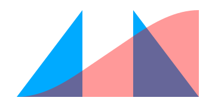
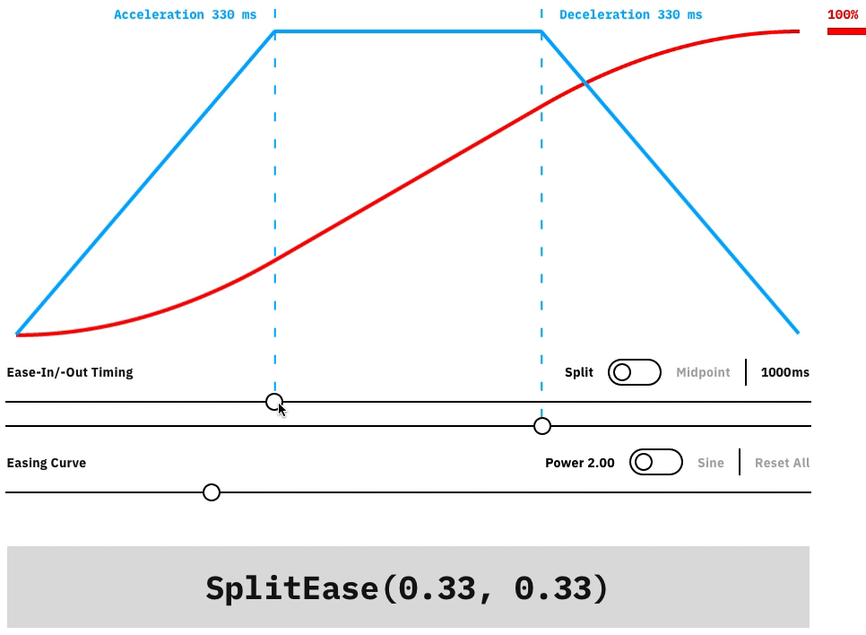

<h1 align="center">
  <a href="https://split-ease.netlify.com">
    
  </a>
  <br>
  SplitEase.js
</h1>

<h3 align="center">The curve with a beginning, middle and end.</h4>

<p align="center">
  <a href="#getting-started">Getting started</a>&nbsp;|&nbsp;
  <a href="#backstory">Backstory</a>
</p>

SplitEase.js is a JavaScript function which offers animators and creative coders a means to compose separately timed variable __acceleration__, __constant-speed__ and __deceleration__ segments in a single continous interpolation. It weighs less than 1k.

For an __interactive visualisation__ of its simple numeric API [see the homepage](https://split-ease.netlify.com).

<p>
  <a href="https://split-ease.netlify.com">
    
  </a>
</p>

## Getting started

### Install via NPM

```bash
$ npm install split-ease --save
```
`import` in your ES6 code
```js
import SplitEase from 'split-ease';
```
or `require` in your CommonJS code
```js
const SplitEase = require('split-ease);
```

### Include via `<script>` tag

get in on unpkg
```html
<script src="//unpkg.com/split-ease" charset="utf-8"></script>
```

or [download](releases/latest) and include a script link to the UMD version.

```html
<script src="split-ease/dist/split-ease.umd.js"></script>
```

## Backstory

Most strictly-timed (i.e. not simulation-based) animation on the web makes use of interpolation (easing) functions originally popularized by [Robert Penner](http://robertpenner.com/easing/) in his [2002 book on programming Flash MX](http://robertpenner.com/profmx/). This book proposed 10 curve-types (Sine, Quad, Cubic, Quart, Quint, Exp, Back, Circ, Elastic, Bounce) times 3 variations (easeIn, easeOut and easeInOut), to offer [30 different patterns of movement](https://easings.net/en).

SplitEase takes the most common of these functions—the Sine and Power (Quad, Cubic, Quart, Quint) curves—and composes their underlying maths in a way that makes their ease-in/-out/-in-out proportions and their power curvature continuously independently variable.

Feedback or questions? [Ping me](https://twitter.com/lunelson).

## Acknowledgements

[Robert Penner](http://robertpenner.com/easing/)
