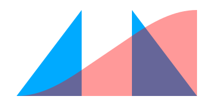

<h1 align="center">
  <a href="https://split-ease.netlify.com">
    
  </a>
  <br>
  SplitEase.js
</h1>

<h4 align="center">The curve with a beginning, middle and end.</h4>
<h4 align="center">< 800 bytes compressed</h4>

<p align="center">
  <a href="https://www.npmjs.com/package/animejs" rel="nofollow">
  
  </a>
  <a href="https://www.npmjs.com/package/animejs" rel="nofollow">
  
  </a>
</p>

<p align="center">
  <a href="#getting-started">Getting started</a>&nbsp;|&nbsp;
  <a href="#documentation">Documentation</a>
</p>

### People to ping

sarah drasner
val head
rachel nabors

xaverfourcrier
https://github.com/xavierfoucrier

legomushroom
creator of mojs
https://github.com/legomushroom
https://twitter.com/legomushroom

gre
creator of numerous easing libs
https://github.com/gre
https://twitter.com/greweb

mattdesl
https://github.com/mattdesl
https://twitter.com/mattdesl

mbostock
creator of d3, d3-ease
https://github.com/mbostock
https://twitter.com/mbostock

### Twitter threads

https://twitter.com/andy_matuschak/status/566736015188963328

### Prior Art

d3/d3-ease
well-visualised here
https://bl.ocks.org/mbostock/248bac3b8e354a9103c4

## Visualisations

d3-ease https://bl.ocks.org/mbostock/248bac3b8e354a9103c4
gsap

## Backstory

original easings created by robert penner
listed here, with their implementations http://gizma.com/easing/


## Getting started

### Install

Via npm install

```bash
$ npm install split-ease --save
```
```js
// import in ES6+
import SplitEase from 'split-ease';

// …or require in CommonJS
const SplitEase = require('split-ease);
```

Via unpkg script include
```html
<script src="//unpkg.com/split-ease" charset="utf-8"></script>
```

or manual [download]() and include a script link to the UMD version.

```html
<script src="split-ease/dist/split-ease.umd.js"></script>
```

## Documentation

#### 1. Midpoint mode

- single numeric argument + options obj
- default curve is power, default exponent is 2
- et1 is basically the amount of the time (duration) that should be taken up by the ease-in portion. The ease-out portion will take up the remaining amount


#### 2. Split mode

- two numeric arguments + options obj
- et1 is the amount of easing time that should be taken up by the ease-in portion
- et2 is the proportional duration of the ease-out portion of the curve. If the total of et1 and et2 is less than 1, there will be a constant-speed segment in between them.

### Advantages

- a drop-in replacement for the entire power range of penner curves, as well as all power curves in between those, plus the sine curve.
- independently controllable ease-in and ease-out timing, while overall duration and displacement remain strict
- e.g. you cannot accurately simulate separately timed acceleration, constant-speed and deceleration of movemement over a strict displacement (e.g. distance) with any standard curves, including cubic-bezier and GSAP's Custom Ease
- you could simulate the movement accurately with Vector math, but doing so over a specified time and displacement is very complex.
-

## Compatibility / Comparisons

penner easings used in
jquery UI

...innumerable packages

libraries

[Popmotion](https://popmotion.io/api/easing/)
```js
import { tween } from 'popmotion';

tween({
  ease: SplitEase(/*...*/)
}).start();
```

[Tween.js](https://github.com/tweenjs/tween.js)
https://github.com/tweenjs/tween.js/blob/master/docs/user_guide.md#changing-the-easing-function-aka-make-it-bouncy
[Tween.js (ES6)](https://github.com/tweenjs/es6-tween/blob/master/API.md)
[How to use Tween.js with Three.js](https://medium.com/@lachlantweedie/animation-in-three-js-using-tween-js-with-examples-c598a19b1263)
```js
const myTween = new TWEEN.Tween(/*...*/);
myTween.easing(SplitEase(/*...*/));
```

[Velocity](http://velocityjs.org/)
http://velocityjs.org/#easing
```js
// register a custom ease in Velocity
$.Velocity.Easings.mySplitEase = SplitEase(/*...*/);
```

[AnimeJS](https://animejs.com/)
https://animejs.com/documentation/#customEasing


[GSAP (Greensock)](https://greensock.com/)
https://greensock.com/docs/Easing/Ease
```js
TweenLite.to(obj, 5, {x:600, ease:new Ease(myEase)});
```
[ThreeJS](https://threejs.org/)
[Popmotion](https://popmotion.io/)

https://github.com/mojs/mojs
https://github.com/mojs/mojs/blob/master/api/easing/path-easing.md
https://codepen.io/sol0mka/#
https://codepen.io/sol0mka/pen/KMWgQp?editors=0010
https://codepen.io/sol0mka/full/ogOYJj/
https://github.com/mojs-contrib/mojs-player
https://github.com/mojs-contrib/mojs-curve-editor
https://github.com/mojs-contrib/mojs-timeline-editor
https://github.com/maxwellito/vivus

## The easing library that's actually easy.

Split-Ease generates uniquely powerful and flexible easing functions for JavaScript animation, by interpolating through separate *acceleration*, *constant-speed*, and *deceleration* segments in variable proportion and curvature.

See [the demo]().

## WTF

## Installation

## API
 (in, constant, out). It integrates "power" and "sine" polynomial curves (such as popularized by Robert Penner c. 2001), in a manner that allows independently-variable proportion and curvature.


## Other projects

https://github.com/mattdesl/eases


# SplitEase

SplitEase is an alternative approach to easing functions for JavaScript which computes ease-curves in terms of separately variable continuous segments, opening a new range of speed-control patterns for interpolation-based motion design and animation.

See [the interactive demo]().

Feedback or questions: [ping me on Twitter](https://twitter.com/lunelson)


### Installation

SplitEase can be installed via NPM or loaded via RawGit/UnPkg. The package includes UMD, CommonJS and ES Module flavors.

```sh
npm install --save-dev @lunelson/split-ease
```
```js
// ES Module
import SplitEase from 'split-ease';
```
```js
// Common JS
const SplitEase = require('split-ease);
```
```html
<!-- HTML script tag -->
<script src="main.js"></script>
```

### Usage

The SplitEase function accepts timing and curve options, and configures and returns an ease function which accepts a single parameter in the range of `0` to `1`. This signature conforms to the APIs of most animation libraries.

```js
```

See the [docs for more examples]().

### Background/Origins


SplitEase is an alternative easing function for animation, that combines variable ease-in, -out and linear segments in a single interpolation.

Play with the demo.

This is the first release. Feedback or questions: ping me on Twitter

## Getting Started

### Installation or linking

```sh
npm install split-ease
```

### Usage

with Anime.js

```js
anime({
  /*
    rest of config
   */
  easing: function(el, i, total) {
    return SplitEase(0.7, 0.2, { pow: 2.2 });
  }
});
```

## Backstory

Most animation uses interpolation (rather than simulation) to create the illusion of movement, and uses 'easing' or 'timing' functions to make this appear natural. The most widely-used of these were introduced by [Robert Penner](http://robertpenner.com/easing/) as part of [his book on programming Macromedia Flash MX  in 2001](http://robertpenner.com/easing/penner_chapter7_tweening.pdf) where he proposed 10 curve-types (Sine, Exp, Back, Circ, Elastic, Bounce, and 4 Power curves) times 3 easing patterns (easeIn, easeOut and easeInOut). These are still found in the source code of jQuery, Velocity, Greensock, and most other animation codebases.

SplitEase takes two of these curve-types (Power and Sine, the most fundamental ones for movement) and makes the easing pattern variable and dynamic: calculating the 'in' (acceleration) and 'out' (deceleration) durations as separate segments and offering the unique possibility of a third, linear (constant-speed) segment; and for the Power set, unifying the sub-types (Quadratic, Cubic, Quartic etc.) by offering power (`p`) as a fourth argument.

## How

The API of time `t` in the range `0..1` is compatible with animation libraries that otherwise use Penner-style easing functions. You may have to wrap SplitEase in an anonymous callback—example here from [tween.js](https://github.com/tweenjs/tween.js):


## Now

Download / Star / Fork this on Github.

[Ping / Follow me on Twitter](https://twitter.com/lunelson).

[Website](https://split-ease.netlify.com/) | [ISC License](LICENSE.md) | © 2019 [Lu Nelson](https://lunelson.xyz).
